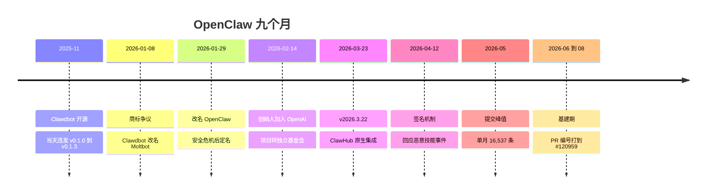

# §0 项目是什么


OpenClaw 是一个开源的个人 AI 助手框架,跑在用户自己的设备上(最常见的形态是一台 Mac Mini),通过 WhatsApp、Telegram、Discord、Signal、iMessage 这些日常聊天应用跟人说话。它能清收件箱、管日历、订机票、执行代码、浏览网页、操控电脑。2025 年 11 月 24 日开源,九个月里成为 GitHub 历史上增长最快的开源项目,社区统计超过 150 万个 agent 被创建。它的吉祥物是龙虾,口号是 The claw is the law。

| 指标 | 数值 |
|---|---|
| 生命周期 | 2025-11-24 到 2026-08-08(约 9 个月) |
| 主线提交数 | 74,472(first-parent 口径) |
| 作者数 | 3,127 |
| tag 数 | 344 |
| release 数 | 233 |
| star 数 | 约 38.5 万 |
| 主要语言 | 以 Go 与 TS 生态为主,多语言并存 |

月度提交量(主线)。

```
2025-11 ████ 288
2025-12 ████████████████████████ 2087
2026-01 ██████████████████████████████████████████████████ 5263
2026-02 ████████████████████████████████████████████████████████████ 6854
2026-03 ████████████████████████████████████████████████████████████████████████ 8050
2026-04 ████████████████████████████████████████████████████████████████████████████████████████ 14586
2026-05 ████████████████████████████████████████████████████████████████████████████████████████████████ 16537
2026-06 ████████████████████████████████████████████ 7036
2026-07 ██████████████████████████████████████████████████████████ 11465
2026-08 ████████████ 2306(截至 8 月 8 日)
```

项目全景 timeline。


