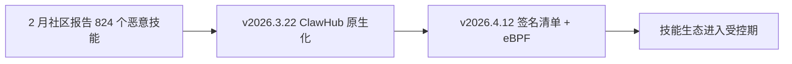

# §11 社区回声

与 git 主线并行的是一条密度极高的社区史,媒体、市场、骗局与社交网络纠缠在一起。

- **龙虾文化**。吉祥物龙虾与 The claw is the law 成为项目的文化符号,社区自称 "lobster"。
- **Moltbook**。一个只有 AI agent 能发帖的社交网络,agent 们(moltys)在上面发帖、点赞、互相评论,OpenClaw 技能让 agent 每小时心跳报到。
- **技能市场**。MoltHub 巅峰 8,000 技能、20 万月活,官方 ClawHub 接手后 3,000 多个技能,还能自动映射 Claude、Codex、Cursor 的技能包。
- **供应链阴影**。824 个恶意技能、假 $CLAWD 代币,社区史里的暗面,两次都被代码层回应(签名机制、改名)。
- **创始人之争**。Meta 的扎克伯格亲自挖人,OpenAI 的 Altman 称他"天才",Anthropic 被媒体称为"最大的失误"。
- **社区规模曲线**。活跃作者从 11 月的 2 人,到 2 月峰值的 654 人,再到 8 月的 151 人。九个月走完了别的开源项目十年的社区周期。

### 互文时刻

拿安全事件画成流程图,社区报告与代码落地隔空相望。

社区先出题,代码后交卷,是这九个月最清晰的互文。改名风暴是另一个方向,代码先改名(1 月 8 日起),社区与市场随后反应(骗局、舆论),品牌事件里代码走在前面。
